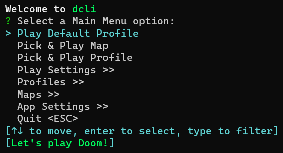

# Welcome to dcli

dcli is a console app for quickly launching Doom games and mods. It has the following features:

- It allows combinations of Engines, IWADs and Map files to be saved as **Profiles** and launched with a single command.
- It can be run interactively via a console UI or with command line arguments.
- It has a list of **Play Settings** that allows you to easily configure items such as Compatibility Level, Warp to a map, enable Fast Monster, No Monsters or Respawn Monsters, and Skill level across Profiles.
- Access to Editors, such as Ultimate Doom Builder and Slade, can be configured to open maps for viewing and editing.
- The ability to view a map readme's in your default text editor based on picking a Profile or map.

dcli is a self contained executable that can be run from anywhere on Windows and macOS. It does not require any installation. On first run it will ask questions to configure itself and create a local Sqlite database to store any settings. It is entirely written in Rust because it's 2023 and we can't keep things simple and use batch files.

You can download the latest release from the [releases page](https://github.com/Pauked/dcli/releases) and then extract the ZIP or DMG file to a folder of your choice.

## Quick Start - CLI

Who doesn't like a command line? The following commands will run the initial setup and then play Sigil.

```powershell
.\dcli.exe init "C:\Doom\Engines" "C:\Doom\IWADs" "C:\Doom\Maps" --force
.\dcli.exe add-profile "Sigil" "C:\Doom\Engines\GZDoom\GZDoom.exe" "C:\Doom\IWADs\Doom.wad" --maps SIGIL_v1_21.wad,SIGIL_SHREDS.wad
.\dcli.exe default --profile "Sigil"
.\dcli.exe play
```

*Assumption corner: You have a legal copy of Doom.wad and have downloaded Sigil to be somewhere in your maps folder so dcli can find it.*

Use ``--help`` to get a list of the available options. For more detailed examples, see the following scripts:

- [Windows PowerShell script](scripts/test_windows.ps1)
- [Windows batch file](scripts/test_windows.bat)
- [macOS bash script](scripts/test_macos.sh)

## Quick Start - Console UI

On first run dcli will detect there is no database and run the initial setup. It will ask for:

- A folder to search for Engines and for you to select the Engines you wish to use.
  - *The folder search is recursive and will find all files in the folder and sub folders.*
- A folder to search for IWADs and for you to select the IWADs you wish to use.
- A folder to search for Maps. Any map files found will be automatically saved.
  - *It will attempt to get the map name and author from the readme file if it exists.*
- Set your default Engine and IWAD.
  - *You can change these later in the App Settings menu.*
- Create a Profile and mark it as your Default Profile.
  - *This can also be changed later in the App Settings menu.*

Once the initial setup is complete, you will be presented with the main menu. The main menu is aimed at being able to **Play Doom Quickly**. Use the arrow keys to go up and down the menu and press Enter to select an option. You can filter the menu down by typing the option name. Menu options ending with ``>>`` will take you to a sub-menu. Pressing Escape will take you back to the previous menu, or quit the app if you are at the main menu.

### Menu Mode

The menus have two modes. Simple and Full. The default is Full. To switch to Simple mode, go to the App Settings menu and select "Menu Mode (Full)" and it will alternate to the opposite menu mode.

#### Full Menu Mode

The full menu mode looks as follows. It lists your Default Profile and the Last Profile you played and contains all of the app functionality.


#### Simple Menu Mode

The Simple menu mode focuses on playing Doom. The Editor and App Settings options are hidden. The menu looks as follows:



From here, you should be good to go! Let's play Doom!

## Supported Engines

dcli will search for the following Engines:

- **Windows** - GZDoom, dsda-Doom, Crispy Doom, Eternity Engine, Doom Retro, Woof
- **macOs** - GZDoom

The above list of Engines is hard coded and the support for arguments across Engines is currently basic and makes assumptions that they are the same. If there is an Engine you would like adding or you find an Engine that doesn't work properly, please raise an issue. For more detail on what is configured, see [doom_data.rs](https://github.com/Pauked/dcli/blob/main/src/doom_data.rs).

## Supported IWADs

dcli will search for the following IWADs:

- Doom (DOOM.WAD)
- Doom II (DOOM2.WAD)
- Final Doom - TNT: Evilution (TNT.WAD)
- Final Doom - The Plutonia Experiment (PLUTONIA.WAD)
- Heretic (HERETIC.WAD)
- Hexen (HEXEN.WAD)
- Hexen: Deathkings of the Dark Citadel (HEXDD.WAD)
- Strife (STRIFE1.WAD)

The files will be checked for [IWAD identifier](https://doomwiki.org/wiki/IWAD). See doom_data.rs, linked above, for more detail.

## Supported Map Extensions

dcli will search for the following map extensions:

- .WAD
- .PK3
- .PKE

WAD files will be checked for the PWAD identifier. No checking is currently done on PK3 and PKE files.

## Why dcli?

 The feature set is based around me wanting to quickly fire up Doom from my StreamDeck so I can continue playing a megawad without having to tinker with config or remember command line arguments. When playing I also want to open the WAD file in an editor to see how a secret works or to view a map's readme to check something. dcli can do that for me. And having written this app, I now can't forget the command line arguments for GZDoom.